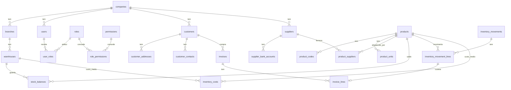

# RELACIONAMENTOS ENTRE ENTIDADES — V1

Requisito: REQ-2026-003 · PR #4 · Resposta a **AUD-REQ-2026-003-R01 / F-004** · Gerado do catálogo do PostgreSQL descartável com P001→P007 aplicados (não do banco real). Cobre só as 56 tabelas V1 do `DICIONARIO-DADOS.md`.

Regra transversal: FK **composta** `(company_id, x_id)` (marcada `composta`) impede que um registro de uma empresa aponte para outra; FK simples só em catálogos globais e em `company_id → companies(id)`.

## 1. Mapa de alto nível

## 2. Cardinalidade e regras de negócio que não cabem em FK

| Relação | Cardinalidade | Regra |
|---|---|---|
| `inventory_costs` ↔ `products`,`warehouses` | 1 linha por (empresa, produto, depósito) | Mantida só por `inventory_post_line`; `valued_quantity` deve igualar o saldo PROPIO físico (`inventory_cost_reconciliation_v` = 0 linhas). |
| `invoice_lines.inventory_movement_line_id` → `inventory_movement_lines` | 0..1 por linha de movimento (índice único parcial) | Vincula a venda à saída que congelou o custo; **definir enquanto a fatura é BORRADOR** (P006 torna EMITIDA/APROBADA imutável). Sem vínculo → `SIN_COSTO` no relatório; nada é inventado. |
| `inventory_movement_lines` | imutável após inserida | Triggers `inventory_movement_lines_guard`/`inventory_movements_guard`; correção = movimento inverso (CUSTEIO-V1 §9, D-C5). |
| `product_components` | autorreferência produto→produto | Kit não pode conter a si mesmo (trigger `product_components_guard`). |
| `user_*` ↔ `branches`/`warehouses` | N:N por usuário | Escopo de acesso REQ-002; ver `PLANO-MIGRACAO-INGLES.md` §5 (lacunas). |

## 3. Lista completa de FKs por tabela (V1)

### Segurança e estrutura da empresa (P001)

| Tabela | Coluna(s) | Referencia | Tipo |
|---|---|---|---|
| `companies` | `base_currency_code` | `currencies` | simples |
| `branches` | `company_id` | `companies` | simples |
| `warehouses` | `branch_id` | `branches` | composta com `company_id` |
| `warehouses` | `company_id` | `companies` | simples |
| `users` | `home_branch_id` | `branches` | composta com `company_id` |
| `users` | `company_id` | `companies` | simples |
| `users` | `created_by` | `users` | composta com `company_id` |
| `roles` | `company_id` | `companies` | simples |
| `role_permissions` | `permission_id` | `permissions` | simples |
| `role_permissions` | `role_id` | `roles` | composta com `company_id`, ON DELETE CASCADE |
| `user_roles` | `role_id` | `roles` | composta com `company_id` |
| `user_roles` | `assigned_by` | `users` | composta com `company_id` |
| `user_roles` | `user_id` | `users` | composta com `company_id`, ON DELETE CASCADE |
| `user_branches` | `branch_id` | `branches` | composta com `company_id` |
| `user_branches` | `assigned_by` | `users` | composta com `company_id` |
| `user_branches` | `user_id` | `users` | composta com `company_id`, ON DELETE CASCADE |
| `user_warehouses` | `assigned_by` | `users` | composta com `company_id` |
| `user_warehouses` | `user_id` | `users` | composta com `company_id`, ON DELETE CASCADE |
| `user_warehouses` | `warehouse_id` | `warehouses` | composta com `company_id` |
| `user_sessions` | `user_id` | `users` | composta com `company_id` |
| `security_events` | `company_id` | `companies` | simples |
| `security_events` | `user_id` | `users` | composta com `company_id` |
| `document_sequences` | `company_id` | `companies` | simples |

### Catálogos globais (sem empresa; P002/P003/P007)

| Tabela | Coluna(s) | Referencia | Tipo |
|---|---|---|---|
| `geo_cities` | `department_code,district_code` | `geo_districts` | simples |
| `geo_districts` | `department_code` | `geo_departments` | simples |

### Clientes (P002)

| Tabela | Coluna(s) | Referencia | Tipo |
|---|---|---|---|
| `customers` | `commercial_zone_id` | `commercial_zones` | composta com `company_id` |
| `customers` | `company_id` | `companies` | simples |
| `customers` | `default_currency_code` | `currencies` | simples |
| `customers` | `customer_group_id` | `customer_groups` | composta com `company_id` |
| `customers` | `delivery_route_id` | `delivery_routes` | composta com `company_id` |
| `customers` | `country_code` | `geo_countries` | simples |
| `customers` | `payment_term_id` | `payment_terms` | composta com `company_id` |
| `customers` | `price_list_id` | `price_lists` | composta com `company_id` |
| `customers` | `sales_channel_id` | `sales_channels` | composta com `company_id` |
| `customers` | `salesperson_id` | `salespeople` | composta com `company_id` |
| `customers` | `created_by` | `users` | composta com `company_id` |
| `customers` | `sales_blocked_by` | `users` | composta com `company_id` |
| `customer_addresses` | `company_id` | `companies` | simples |
| `customer_addresses` | `customer_id` | `customers` | composta com `company_id` |
| `customer_addresses` | `department_code,district_code,city_code` | `geo_cities` | simples |
| `customer_addresses` | `country_code` | `geo_countries` | simples |
| `customer_contacts` | `company_id` | `companies` | simples |
| `customer_contacts` | `customer_id` | `customers` | composta com `company_id` |
| `customer_documents` | `company_id` | `companies` | simples |
| `customer_documents` | `customer_id` | `customers` | composta com `company_id` |
| `customer_documents` | `uploaded_by` | `users` | composta com `company_id` |
| `customer_groups` | `company_id` | `companies` | simples |
| `commercial_zones` | `company_id` | `companies` | simples |
| `sales_channels` | `company_id` | `companies` | simples |
| `salespeople` | `company_id` | `companies` | simples |
| `delivery_routes` | `company_id` | `companies` | simples |
| `payment_terms` | `company_id` | `companies` | simples |

### Proveedores (P003)

| Tabela | Coluna(s) | Referencia | Tipo |
|---|---|---|---|
| `suppliers` | `company_id` | `companies` | simples |
| `suppliers` | `default_currency_code` | `currencies` | simples |
| `suppliers` | `incoterm_code` | `incoterms` | simples |
| `suppliers` | `preferred_payment_method_id` | `payment_methods` | simples |
| `suppliers` | `payment_term_id` | `payment_terms` | composta com `company_id` |
| `suppliers` | `supplier_group_id` | `supplier_groups` | composta com `company_id` |
| `suppliers` | `created_by` | `users` | composta com `company_id` |
| `supplier_addresses` | `company_id` | `companies` | simples |
| `supplier_addresses` | `supplier_id` | `suppliers` | composta com `company_id`, ON DELETE CASCADE |
| `supplier_contacts` | `company_id` | `companies` | simples |
| `supplier_contacts` | `supplier_id` | `suppliers` | composta com `company_id`, ON DELETE CASCADE |
| `supplier_bank_accounts` | `company_id` | `companies` | simples |
| `supplier_bank_accounts` | `currency_code` | `currencies` | simples |
| `supplier_bank_accounts` | `supplier_id` | `suppliers` | composta com `company_id`, ON DELETE CASCADE |
| `supplier_documents` | `company_id` | `companies` | simples |
| `supplier_documents` | `supplier_id` | `suppliers` | composta com `company_id`, ON DELETE CASCADE |
| `supplier_documents` | `created_by` | `users` | composta com `company_id` |
| `supplier_groups` | `company_id` | `companies` | simples |
| `supplier_withholdings` | `company_id` | `companies` | simples |
| `supplier_withholdings` | `supplier_id` | `suppliers` | composta com `company_id`, ON DELETE CASCADE |
| `supplier_withholdings` | `tax_id` | `taxes` | simples |

### Productos (P003)

| Tabela | Coluna(s) | Referencia | Tipo |
|---|---|---|---|
| `products` | `company_id` | `companies` | simples |
| `products` | `brand_id` | `product_brands` | composta com `company_id` |
| `products` | `category_id` | `product_categories` | composta com `company_id` |
| `products` | `tax_id` | `taxes` | simples |
| `products` | `unit_of_measure_id` | `units_of_measure` | simples |
| `products` | `created_by` | `users` | composta com `company_id` |
| `product_brands` | `company_id` | `companies` | simples |
| `product_categories` | `company_id` | `companies` | simples |
| `product_codes` | `company_id` | `companies` | simples |
| `product_codes` | `product_id` | `products` | composta com `company_id`, ON DELETE CASCADE |
| `product_units` | `company_id` | `companies` | simples |
| `product_units` | `product_id` | `products` | composta com `company_id`, ON DELETE CASCADE |
| `product_units` | `unit_of_measure_id` | `units_of_measure` | simples |
| `product_warehouse_settings` | `company_id` | `companies` | simples |
| `product_warehouse_settings` | `product_id` | `products` | composta com `company_id`, ON DELETE CASCADE |
| `product_warehouse_settings` | `warehouse_id` | `warehouses` | composta com `company_id` |
| `product_suppliers` | `company_id` | `companies` | simples |
| `product_suppliers` | `currency_code` | `currencies` | simples |
| `product_suppliers` | `product_id` | `products` | composta com `company_id`, ON DELETE CASCADE |
| `product_suppliers` | `supplier_id` | `suppliers` | composta com `company_id` |
| `product_suppliers` | `unit_of_measure_id` | `units_of_measure` | simples |
| `product_alternatives` | `company_id` | `companies` | simples |
| `product_alternatives` | `alternative_product_id` | `products` | composta com `company_id`, ON DELETE CASCADE |
| `product_alternatives` | `product_id` | `products` | composta com `company_id`, ON DELETE CASCADE |
| `product_components` | `company_id` | `companies` | simples |
| `product_components` | `component_product_id` | `products` | composta com `company_id` |
| `product_components` | `kit_product_id` | `products` | composta com `company_id`, ON DELETE CASCADE |
| `product_documents` | `company_id` | `companies` | simples |
| `product_documents` | `product_id` | `products` | composta com `company_id`, ON DELETE CASCADE |
| `product_documents` | `uploaded_by` | `users` | composta com `company_id` |

### Stock, movimientos e custo (P005/P007)

| Tabela | Coluna(s) | Referencia | Tipo |
|---|---|---|---|
| `stock_balances` | `company_id` | `companies` | simples |
| `stock_balances` | `product_id` | `products` | composta com `company_id` |
| `stock_balances` | `product_id,lot_id` | `stock_lots` | composta com `company_id` |
| `stock_balances` | `warehouse_id` | `warehouses` | composta com `company_id` |
| `stock_lots` | `company_id` | `companies` | simples |
| `stock_lots` | `product_id` | `products` | composta com `company_id` |
| `inventory_movements` | `branch_id` | `branches` | composta com `company_id` |
| `inventory_movements` | `company_id` | `companies` | simples |
| `inventory_movements` | `created_by` | `users` | composta com `company_id` |
| `inventory_movements` | `destination_warehouse_id` | `warehouses` | composta com `company_id` |
| `inventory_movements` | `source_warehouse_id` | `warehouses` | composta com `company_id` |
| `inventory_movement_lines` | `company_id` | `companies` | simples |
| `inventory_movement_lines` | `cost_currency_code` | `currencies` | simples |
| `inventory_movement_lines` | `goods_receipt_line_id` | `goods_receipt_lines` | composta com `company_id` |
| `inventory_movement_lines` | `movement_id` | `inventory_movements` | composta com `company_id` |
| `inventory_movement_lines` | `product_id` | `products` | composta com `company_id` |
| `inventory_movement_lines` | `product_id,lot_id` | `stock_lots` | composta com `company_id` |
| `inventory_costs` | `company_id` | `companies` | simples |
| `inventory_costs` | `product_id` | `products` | composta com `company_id` |
| `inventory_costs` | `warehouse_id` | `warehouses` | composta com `company_id` |

### Ventas — somente o necessário para o relatório ao custo (P006/P007)

| Tabela | Coluna(s) | Referencia | Tipo |
|---|---|---|---|
| `invoices` | `branch_id` | `branches` | composta com `company_id` |
| `invoices` | `company_id` | `companies` | simples |
| `invoices` | `currency_code` | `currencies` | simples |
| `invoices` | `customer_id` | `customers` | composta com `company_id` |
| `invoices` | `created_by` | `users` | composta com `company_id` |
| `invoice_lines` | `company_id` | `companies` | simples |
| `invoice_lines` | `inventory_movement_line_id` | `inventory_movement_lines` | composta com `company_id` |
| `invoice_lines` | `invoice_id` | `invoices` | composta com `company_id` |
| `invoice_lines` | `product_id` | `products` | composta com `company_id` |
| `invoice_lines` | `tax_id` | `taxes` | simples |

## Autoverificação

- FKs listadas = FKs do catálogo das tabelas V1 (contagem: 133); nenhuma digitada à mão.
- Vale só para o esquema **proposto**; as FKs do banco real continuam NAO_VERIFICADO (F-001).